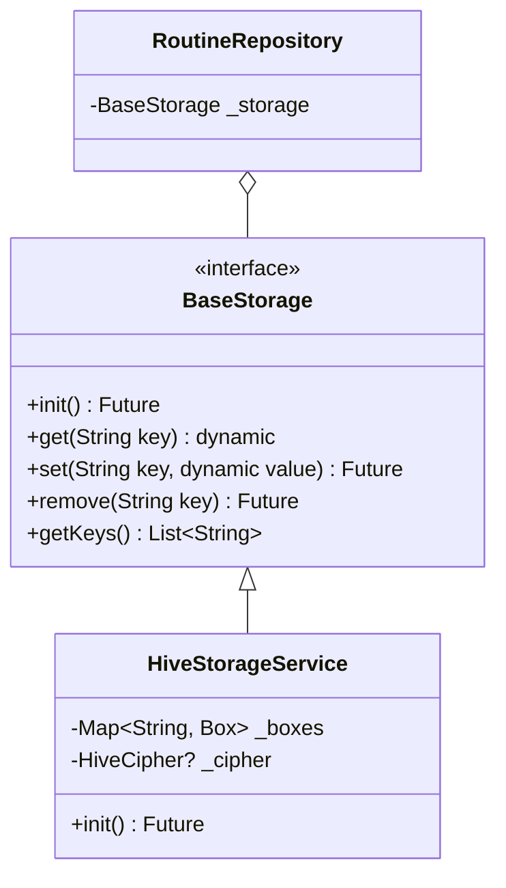

# Design Doc: Local Database Migration (Hive)

**Date**: 2026-04-30  
**Topic**: Storage Infrastructure Upgrade  
**Status**: Approved

## 1. Goal
Migrate Bookend's persistent storage from `SharedPreferences` to a structured, high-performance NoSQL database (**Hive**) to improve data integrity, enable encryption for sensitive user data, and support complex data types via TypeAdapters.

## 2. Architecture

### 2.1 Storage Layer
We will introduce a `BaseStorage` abstract class to decouple the repository from the storage implementation.

### 2.2 Data Organization (Boxes)
*   **`meta`**: App-level flags (e.g., `onboarding_completed`, `migration_done`).
*   **`routines`**: Custom morning and night routine task lists.
*   **`activity`**: Completion histories (keyed by `completion_{type}_{date}`) and streak counts.
*   **`journal` (Encrypted)**: Daily journal entries.

### 2.3 Encryption
*   **Mechanism**: AES-256 (Hive standard cipher).
*   **Key Management**: A 32-byte key generated on first launch and stored in **`flutter_secure_storage`**.
*   **Scope**: Only the `journal` box will be encrypted to balance security and performance.

## 3. Migration Strategy

A `StorageMigrationService` will handle the one-time transition:
1.  Check `meta.migration_done`.
2.  If `false`:
    *   Open `SharedPreferences`.
    *   Extract routine JSONs -> Save to `routines` box.
    *   Extract streak data -> Save to `activity` box.
    *   Extract journal entries -> Save to `journal` box.
    *   Set `migration_done = true`.
3.  If `true`: Skip.

## 4. Model Changes
*   `RoutineTask` will be updated with `@HiveType` and `@HiveField` annotations.
*   `build_runner` will generate `routine_task.g.dart`.

## 5. Success Criteria
*   [x] Existing users retain all routines, streaks, and journal entries.
*   [x] Journal data is unreadable in the raw database file without the secure key.
*   [x] All existing `RoutineRepository` tests pass after updating the dependency.
*   [x] App startup time remains < 500ms on modern devices.
